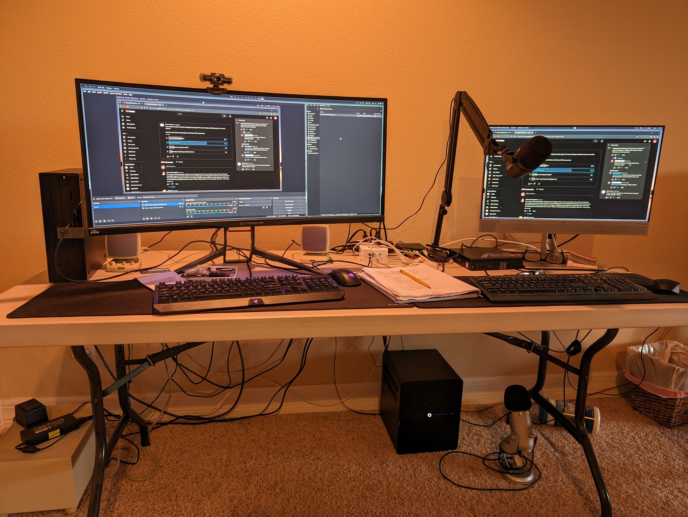
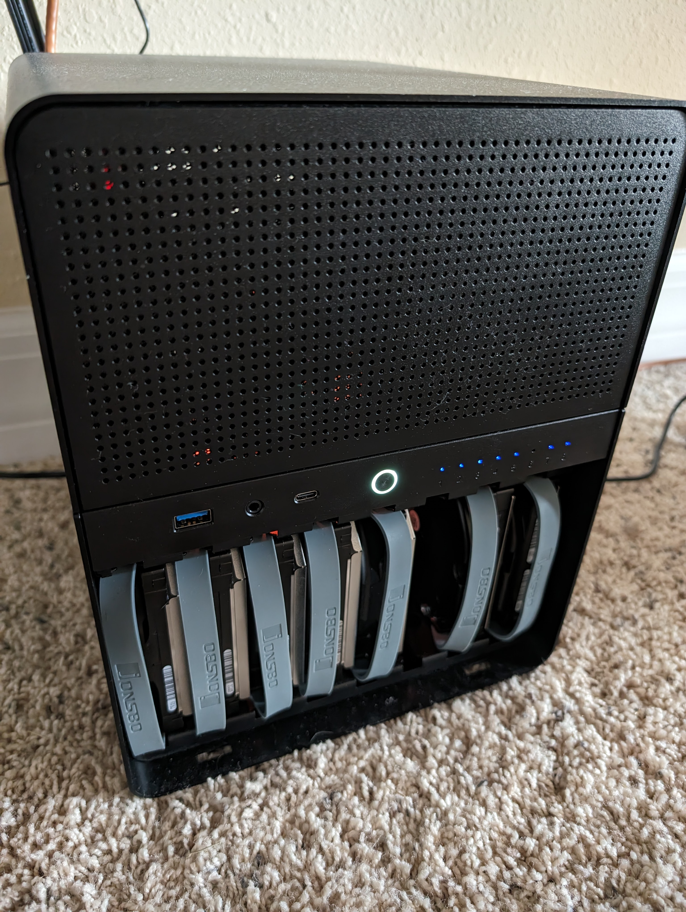
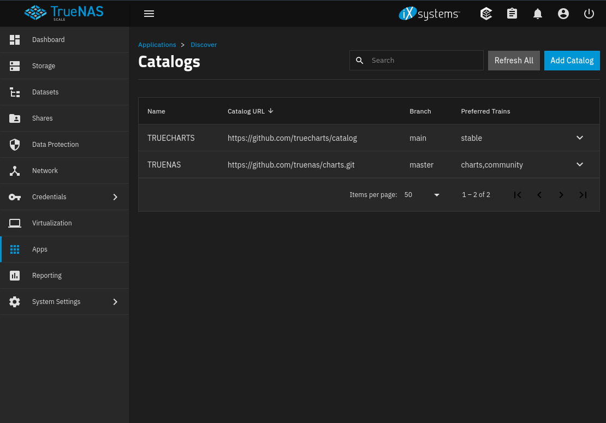
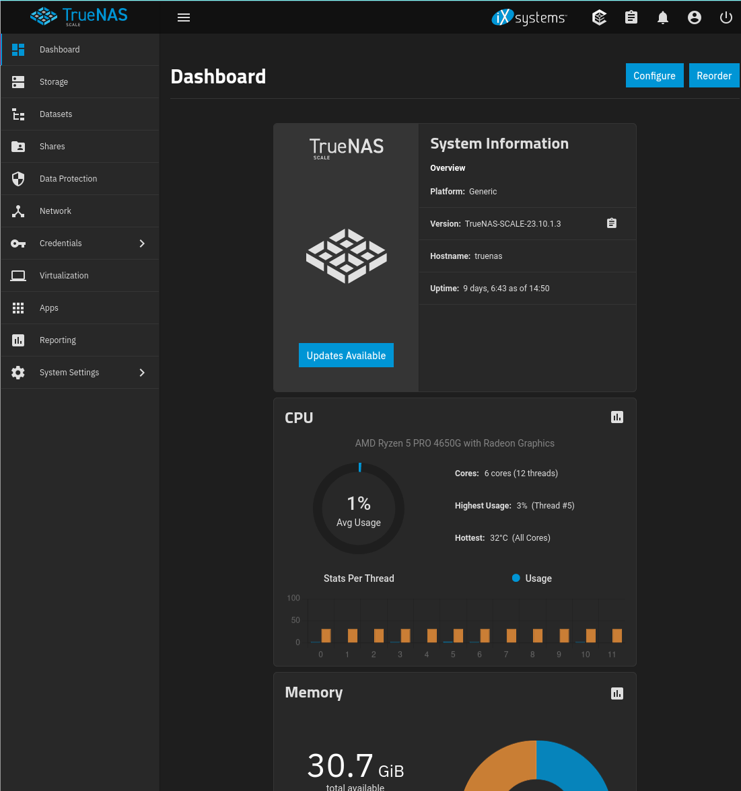
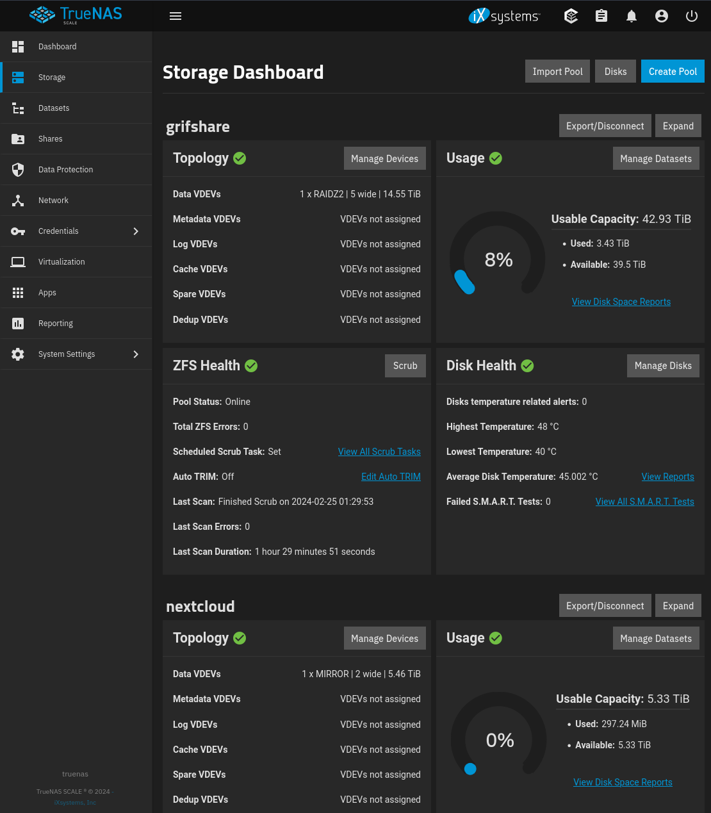
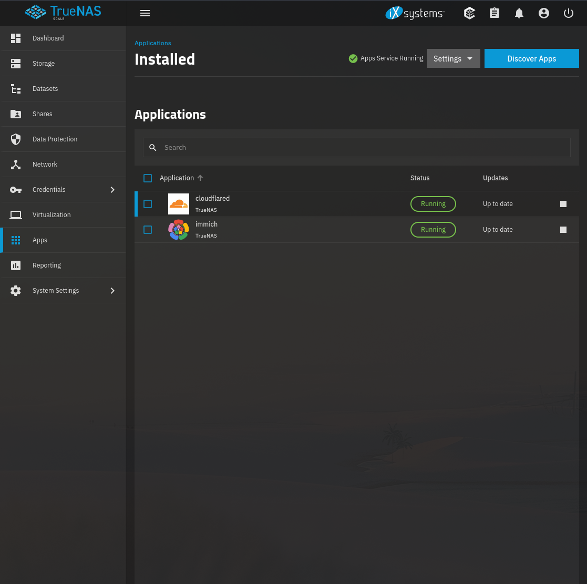

# My Home Lab
Naturally, everyone has a different criteria.  My goal is to replace a cloud drive backup like Google Drive. 

The question is: did I overspend…  likely yes.

*See the Jonsbo N3 case underneath the table*

## Hardware
* Case:  JONSBO N3 Mini-ITX NAS PC Chassis, ITX Computer Case
* Motherboard:  # GIGABYTE B550I AORUS PRO AX
* CPU: AMD Ryzen 5 PRO 4650G Renoir CPU Processor 6Core 12Thread 3.7GHz 7nm DDR4 65W
* G.SKILL Ripjaws V Series (Intel XMP) DDR4 RAM 32GB (2x16GB) 3200MT/s CL16-18-18-38 1.35V Desktop Computer Memory UDIMM - Black (F4-3200C16D-32GV)
* SATA-III Cable:0.5M, 4Pcs/Set-SATA Cable 90-Degree Right-Angle SATA-Data Cable SAS/SATA-6Gbps Cable for Server-Raid Computer SDD HDD CD DVD Drive
* WD BLACK 1TB SN850 NVMe Internal Gaming SSD Solid State Drive with Heatsink
* FSP Mini ITX Solution/SFX 12V / Micro ATX 80 Plus Gold Certified Full Modular Gaming Power Supply Series Group (450W)
* SATA Card, PCIE 3.0, 4 Port with 4 SATA Cable, SATA Controller Expansion Card with Low Profile Bracket, Non-Raid, Boot as System Disk, Support 4 SATA 3.0 Devices
## Hard Drives
* 5 16TB WD Red Pro NAS Hard Drives (make sure you look for specials on the WD website.  Buy 2 for 20+% off)
* 2 6TB WD Red Pro NAS Hard Drives

## Software
* [TrueNAS Scale](https://www.truenas.com/truenas-scale/)

Why?  TrueNAS Scale is FOSS and based on Debian.  Because it is based on Debian and FREE, it has Applications that are built by IX Systems and the Community.
With Virtualization and File Management

